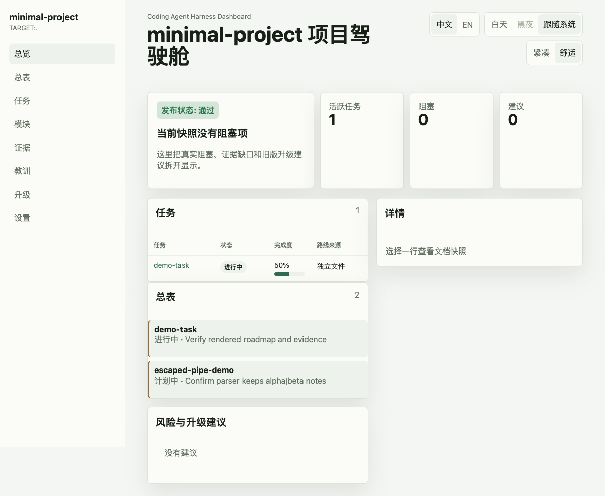

# Coding Agent Harness

[](https://skills.sh/FairladyZ625/coding-agent-harness)

English | [简体中文](README.zh-CN.md) | [日本語](docs-release/intl/ja-JP.md) | [한국어](docs-release/intl/ko-KR.md) | [Français](docs-release/intl/fr-FR.md) | [Español](docs-release/intl/es-ES.md) | [Deutsch](docs-release/intl/de-DE.md)

> A repo-native operating layer for coding agents. It gives Codex, Claude Code, Gemini CLI, Cursor-style agents, and similar tools a durable way to plan, execute, review, and hand off long-running software work.


## What You Get

Coding Agent Harness turns agent work into visible repository facts:

- `AGENTS.md` and reference docs tell agents how to operate in the project.
- Task plans, execution strategies, progress logs, reviews, and closeout records keep long work inspectable.
- Regression and migration checks show what changed and what still needs attention.
- A local Dashboard lets humans review status, warnings, task state, and evidence without reading every Markdown file.

The point is simple: the next agent should resume from the repository, not from chat memory.

## How It Works

| Step | Human Experience | Agent / CLI Surface |
| --- | --- | --- |
| 1. Install | Give your agent the Harness entrypoint. | `npx skills add FairladyZ625/coding-agent-harness --skill coding-agent-harness` |
| 2. Initialize or migrate | The agent diagnoses the repo, proposes a plan, then writes the harness files you approve. | `npx --yes coding-agent-harness init ...` or `migrate-plan` |
| 3. Review the workbench | Open a local Dashboard to inspect tasks, warnings, reviews, and evidence. | `npx --yes coding-agent-harness dev .` |
| 4. Verify | Run project checks before handoff or release. | `npx --yes coding-agent-harness check --profile target-project .` |



## Try It In A Project

Use `npx` first. It does not add the CLI to your project dependencies.

```bash
npx --yes coding-agent-harness init --locale en-US --capabilities core,dashboard .
npx --yes coding-agent-harness dev .
npx --yes coding-agent-harness check --profile target-project .
```

For Chinese templates:

```bash
npx --yes coding-agent-harness init --locale zh-CN --capabilities core,dashboard .
```

If you want a static evidence snapshot instead of the live local workbench:

```bash
npx --yes coding-agent-harness dashboard --out-dir tmp/harness-dashboard .
open tmp/harness-dashboard/index.html
```

## What The Agent Reads

Harness is ordinary repository content. There is no required database or background service.

```text
AGENTS.md
docs/
  03-ARCHITECTURE/
  04-DEVELOPMENT/
  05-TEST-QA/
  09-PLANNING/TASKS/
  10-WALKTHROUGH/
  11-REFERENCE/
```

Typical task files:

```text
task_plan.md
execution_strategy.md
visual_map.md
progress.md
review.md
lesson_candidates.md
```

Humans can scan the Dashboard and briefs. Agents can read the structured files and continue the work with the same operating contract.

## Language Support

| Language | Public intro | README / guides | Executable templates |
| --- | --- | --- | --- |
| English | Full | Full | Full |
| Simplified Chinese | Full | Full | Full |
| Japanese | Intro | Routing only | Use English templates |
| Korean | Intro | Routing only | Use English templates |
| French | Intro | Routing only | Use English templates |
| Spanish | Intro | Routing only | Use English templates |
| German | Intro | Routing only | Use English templates |

Intro-only languages are intentionally lightweight. Agent-executable templates are maintained in English and Simplified Chinese first, because stale translated instructions can create bad agent behavior.

## Good Fit

Coding Agent Harness is useful when:

- agents work on real repositories for days or weeks;
- multiple agents or developers share the same project;
- task state, review evidence, and regression results need to survive across sessions;
- an existing project has old plans, migration notes, or scattered agent instructions;
- a team wants AI development to be visible and reviewable instead of hidden in chat logs.

## Install The Skill

If your agent supports Skills:

```bash
npx skills add FairladyZ625/coding-agent-harness --list
npx skills add FairladyZ625/coding-agent-harness --skill coding-agent-harness
```

Install into the global Codex skill directory:

```bash
npx skills add FairladyZ625/coding-agent-harness \
  --skill coding-agent-harness \
  --agent codex \
  --global \
  -y
```

Agents should not silently run a global npm install. If a long-lived `harness` command is desired, ask the human first:

```bash
npm install -g coding-agent-harness
harness --help
```

## Agent Prompt

Send this to an agent inside your target project:

```text
Install and read Coding Agent Harness first:

npx skills add FairladyZ625/coding-agent-harness --skill coding-agent-harness

First diagnose the project structure, then give me an initialization or migration plan.
Do not overwrite existing business docs, historical tasks, regression records, or user changes.

Use npx unless I explicitly approve a global npm install:
npx --yes coding-agent-harness <command>

After confirmation, execute Diagnose -> Decide -> Scaffold -> Configure -> Verify -> Deliver.
When finished, report created files, check results, Dashboard URL or HTML path, and recommended next steps.
```

## Learn More

- Docs release index: [`docs-release/README.md`](docs-release/README.md)
- Agent installation guide: [`docs-release/guides/agent-installation.en-US.md`](docs-release/guides/agent-installation.en-US.md)
- Architecture overview: [`docs-release/architecture/overview.md`](docs-release/architecture/overview.md)
- Migration playbook: [`docs-release/guides/migration-playbook.en-US.md`](docs-release/guides/migration-playbook.en-US.md)
- Operating models: [`docs-release/guides/repository-operating-models.en-US.md`](docs-release/guides/repository-operating-models.en-US.md)
- Minimal project example: [`examples/minimal-project/`](examples/minimal-project/)

## Star History

[](https://star-history.com/#FairladyZ625/coding-agent-harness&Date)

## License

MIT
