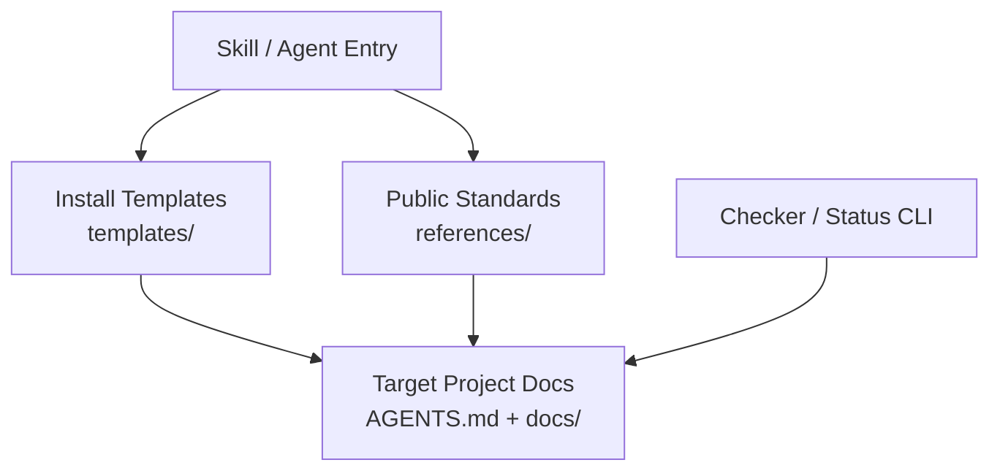
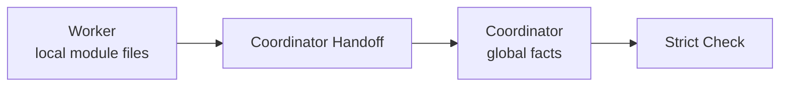

# Architecture Overview

Coding Agent Harness is a document-governed operating layer for long-running coding
agent work. It uses repository-native files, state contracts, role boundaries, and
checks to keep agent sessions auditable and recoverable.

## Public Architecture

## Operating Principle

The harness separates three concerns:

| Layer | Responsibility |
| --- | --- |
| Public package | Ships reusable standards, templates, and checker logic. |
| Target project docs | Store the project's live plans, SSoTs, ledgers, and evidence. |
| Private operations | Store repository-local review drafts, handoffs, and release decisions. |

The public package should describe the system. It should not publish private
operating ledgers from this repository or from any target project.

## Worker / Coordinator Boundary

Workers own local task and module facts. Coordinators own global projections such
as registries, ledgers, closeout indexes, and regression state.
