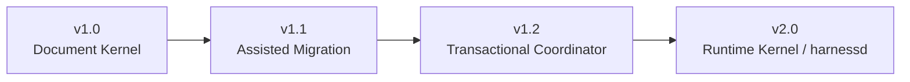

# Release Roadmap

The original large v1.0 plan is split into a staged release line.

## v1.0: Document Kernel

Goal: provide a stable public package and a low-risk document governance kernel.

Includes:

- Compatibility wrapper for the existing checker.
- `harness check` and `harness status`.
- Core standards, templates, examples, and CI.
- State machines as contracts and checker rule indexes.

Does not include automatic global table writes.

## v1.1: Assisted Migration

Goal: help old installations move forward without an automatic upgrade engine.

Includes:

- Read-only audit.
- Migration plan generation.
- Human-approved manual migration workflow.

## v1.2: Transactional Coordinator

Goal: safely apply coordinator-owned global table updates.

Required before apply mode:

- Lock.
- Journal.
- Patch plan.
- Per-file backup.
- Atomic writes.
- Post-check before clearing pending handoff.
- Idempotent retry.

## v2.0: Runtime Kernel

Goal: introduce a long-running coordination service without replacing Markdown as
the source of truth.

Potential responsibilities:

- Session registry.
- Write-scope leases.
- Global table locks.
- Transaction journal.
- Status API.
- Optional dashboard API.
