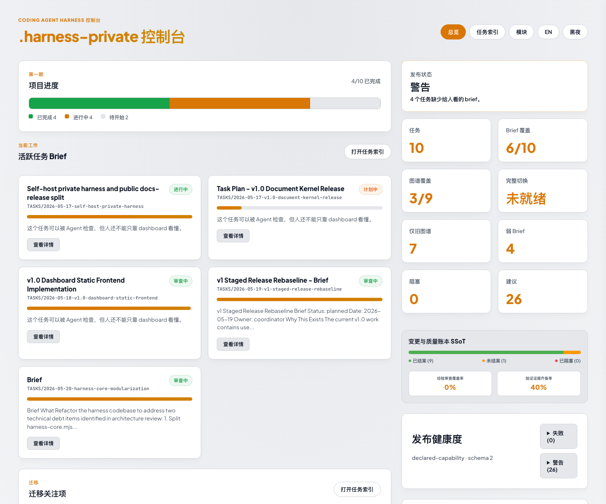

# Coding Agent Harness

Coding Agent Harness est une couche de travail, native au depot, pour les agents de code. Elle aide Codex, Claude Code, Gemini CLI, les agents de style Cursor et les outils similaires a planifier, suivre, revoir et reprendre des travaux logiciels longs.

## Fonctionnement

1. Installez le Skill ou lancez le CLI avec `npx`.
2. L'agent analyse le depot et propose un plan d'initialisation ou de migration.
3. Le Dashboard local affiche les taches, alertes, preuves et etats de revue.
4. Les verifications harness confirment l'etat avant livraison.

## Langues

Les modeles executables et la documentation complete sont maintenus en English et Simplified Chinese. Cette page est une introduction courte.

Start here: [`../../README.md`](../../README.md).
