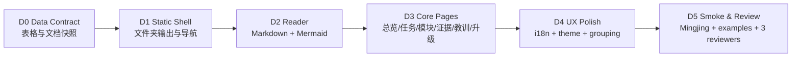

# v1.0 Dashboard Static Frontend Visual Roadmap

| Phase ID | Depends On | State | Completion | Output | Required Evidence | Evidence Status | Blocking Risk | Owner / Handoff |
| --- | --- | --- | --- | --- | --- | --- | --- | --- |
| D0 | none | planned | 0 | normalized table/document/adoption data model | parser fixtures; `tables.json`; `documents.json` | missing | table semantics drift | coordinator |
| D1 | D0 | planned | 0 | `dashboard --out-dir` static folder shell | generated folder smoke; no target mutation | missing | backward compatibility with `--out` | coordinator |
| D2 | D1 | planned | 0 | Markdown reader and Mermaid renderer | markdown fixture; mermaid success/failure smoke | missing | external dependency / offline support | coordinator |
| D3 | D2 | planned | 0 | PLM B-style pages for Overview, Tasks, Modules, Evidence, Lessons, Adoption | Playwright screenshot; page presence assertions | missing | UI becomes data dump again | coordinator + UX reviewer |
| D4 | D3 | planned | 0 | ZH/EN, light/dark, warning grouping, density controls | UI smoke in both languages/themes | missing | text overflow / unclear labels | coordinator + UX reviewer |
| D5 | D4 | planned | 0 | final review and release candidate | `npm test`; Mingjing smoke; 3-reviewer loop no P0/P1/P2 | missing | review finds blocker | coordinator |

Dashboard progress is calculated from this phase table during execution, not from
prose. `Completion` is an integer `0..100`; `done=100`, `planned=0`, and
`skipped` is excluded from the overall dashboard average.
