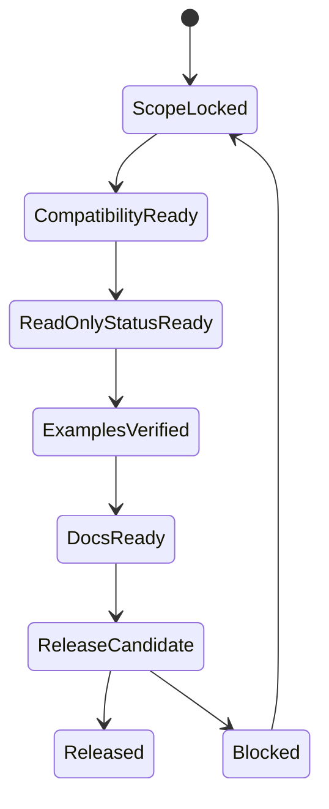

# v1.0 Document Kernel Plan

v1.0 turns Coding Agent Harness into a public, installable, checkable document
governance kernel. It intentionally avoids automatic writes to global state tables.

## State Machine

## Work Slices

| Slice | Goal | Public Output | Exit Criteria |
| --- | --- | --- | --- |
| V10-01 | Package baseline | `package.json`, README, version, changelog | Existing checker still works |
| V10-02 | CLI compatibility | `harness check` wrapper | Same pass/fail behavior as `scripts/check-harness.mjs` |
| V10-03 | Read-only status | `harness status` | Summarizes known harness state without writing files |
| V10-04 | Init dry run | `harness init --dry-run` | Shows planned files without mutating target projects |
| V10-05 | Examples | minimal and module-parallel example projects | Examples pass checker |
| V10-06 | Public docs | architecture, concepts, guides | Public docs contain no private operating state |
| V10-07 | CI and release check | local and CI scripts | Release candidate can be verified from a clean checkout |

## Explicit Non-Goals

- No `coordinator-pass --apply`.
- No automatic edits to `Module-Registry.md`, `Harness-Ledger.md`, `Closeout-SSoT.md`, or `Regression-SSoT.md`.
- No automatic migration engine.
- No `check --fix` global table writes.
- No dashboard or generated site.
- No long-running `harnessd` service.

## Acceptance Criteria

v1.0 is done when:

- Existing consumers can keep calling `scripts/check-harness.mjs`.
- New consumers can call `harness check` and `harness status`.
- Examples demonstrate the supported document layouts.
- CI runs only implemented commands.
- Public documentation explains the kernel boundary and the v1.1/v1.2/v2.0 path.
- All release residuals are recorded instead of hidden inside the plan.
