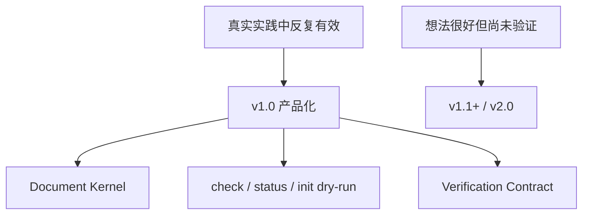
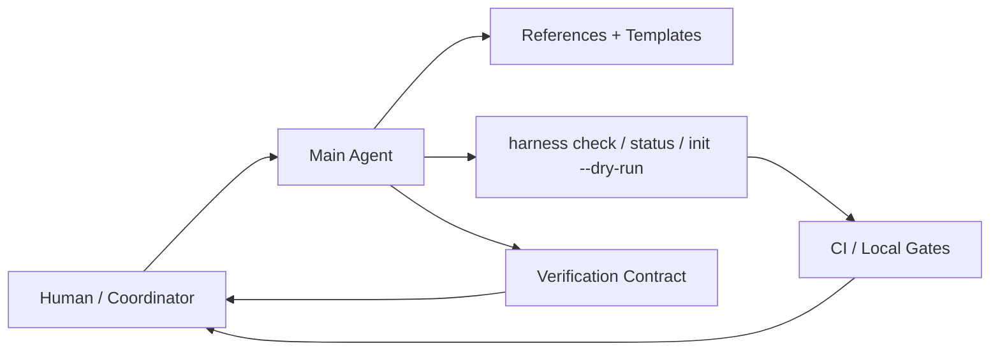
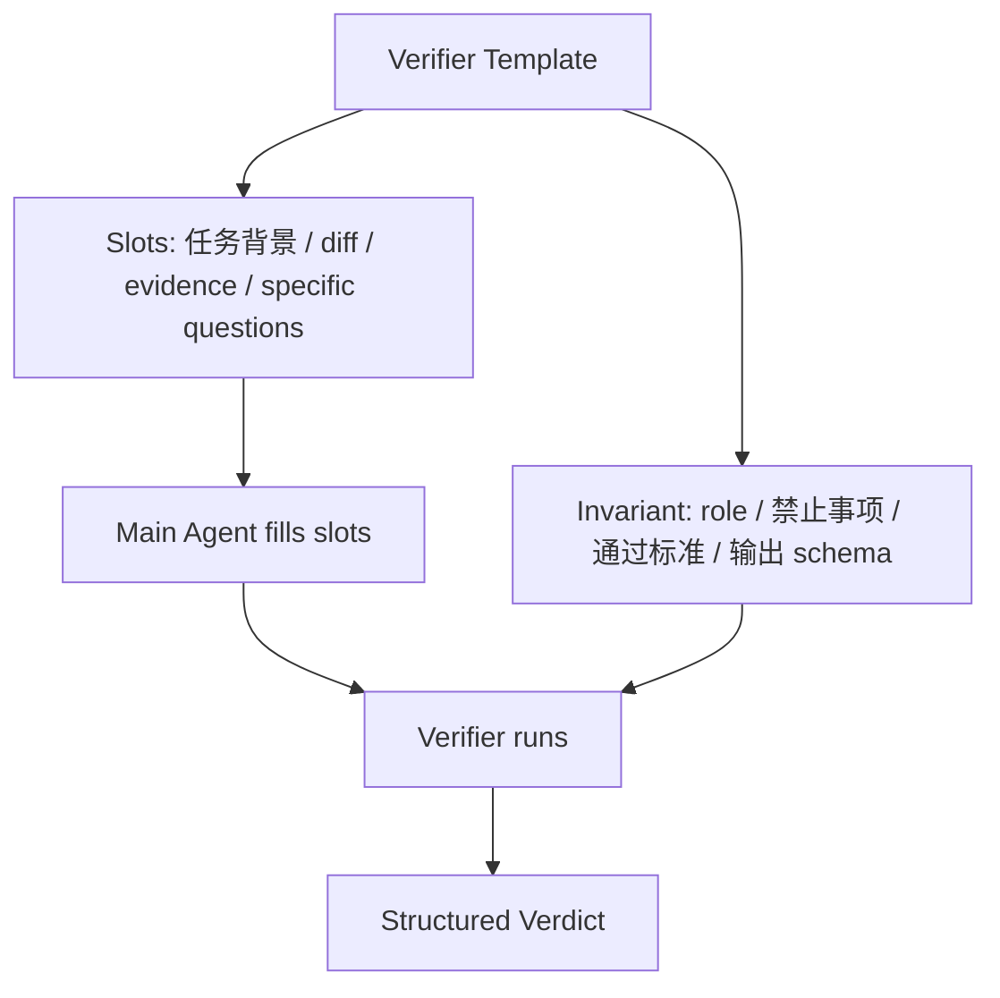
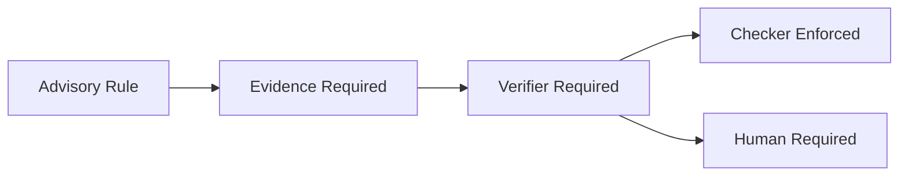
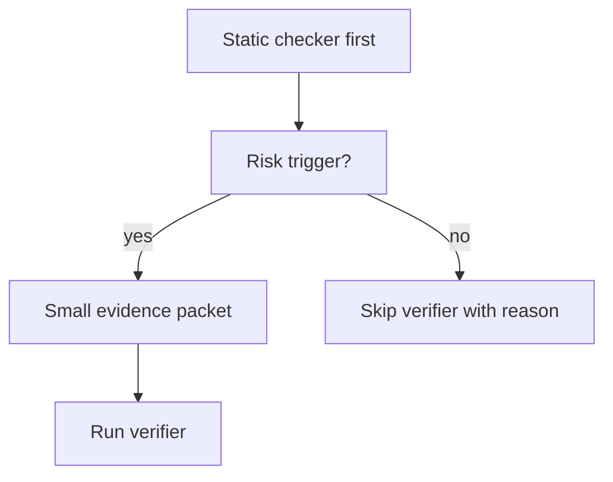

# Coding Agent Harness v1.0 Final Check

这份文档用于最终确认 v1.0 要做什么、不做什么，以及如何把已有实践产品化而不是复杂化。

## 1. 一句话

v1.0 不是完整操作系统，也不是自动化平台。v1.0 是：

```text
Document Kernel + Check/Status CLI + Verification Contract
```

它把我们实践中已经有效的 harness 固化下来，但不引入自动写全局表、不引入 dashboard、不引入常驻后端。

## 2. 产品化边界



原则：

- 从实践长出来的进入 v1.0。
- 只是讨论中觉得好的，先不进 v1.0。
- 每新增一个规则，必须减少一种真实人工摩擦。
- 每新增一个 agent 流程，必须有触发条件和上下文预算。

## 3. v1.0 总体结构



v1.0 里，脚本只检查和展示状态。全局事实仍由 coordinator 手动写入。

## 4. 我们要做的所有事情

| Step | 名称 | 交付物 | 不变量 |
| --- | --- | --- | --- |
| V10-00 | Scope Lock | v1.0 scope、non-goals、final-check 文档 | 不把 v1.1/v1.2/v2.0 塞进 v1.0 |
| V10-01 | Package Baseline | `package.json`、README、CHANGELOG、version | 公开包能被理解和安装 |
| V10-02 | `harness check` | CLI wrapper + checker compatibility | 旧 `scripts/check-harness.mjs` 不坏 |
| V10-03 | `harness status` | 只读状态摘要，支持 JSON | 不写任何项目文件 |
| V10-04 | `harness init --dry-run` | 初始化计划预览 | dry-run 不落盘 |
| V10-05 | Examples | minimal + module-parallel examples | examples 能被 checker 验证 |
| V10-06 | Public Docs | architecture、release roadmap、guides | 不包含私有运营状态 |
| V10-07 | CI / Release Check | 只跑已实现命令 | 不把未来命令写进 CI |
| V10-08 | Verification Contract | verifier 模板机制 + review 输出格式 | 主 agent 可填槽，但不能改审查不变量 |
| V10-09 | Final Review | release decision、residuals、closeout | 无 open P0/P1 |

## 5. Verification Contract，不是固定死的 verifier

我们不做“完全预定义 prompt”。那太僵硬，也不能具体问题具体分析。

我们做的是“模板不变量 + 任务填槽”：



主 agent 可以填：

- 当前任务背景
- 相关 diff
- 相关 acceptance criteria
- 已跑 evidence
- 需要重点看的具体风险

主 agent 不能改：

- verifier 的审查立场
- 禁止放水规则
- severity 定义
- verdict 格式
- P0/P1 处理规则

## 6. Verifier 模板目录，先小后大

v1.0 不需要一次做十几个 subagent 类型。v1.0 只定义机制和最小 starter set：

| Template | 关注点 | 什么时候用 |
| --- | --- | --- |
| scope-boundary-review | 是否越界、是否混入未来版本能力 | release、public package、架构变更 |
| evidence-review | 结论和证据是否匹配 | checker、CI、脚本、release claim |
| regression-risk-review | 回归风险和缺失测试 | shared logic、checker、workflow 变更 |
| entropy-review | 是否增加不必要复杂度 | 新规范、新流程、新 agent 类型 |

以后可以扩展更多模板，但每个模板必须说明：

```text
为什么需要它
它替代了哪种人工摩擦
它的触发条件是什么
它的输入预算是多少
它的输出 schema 是什么
```

## 7. Checker 能强制什么



v1.0 checker 不判断“审美好不好”或“架构一定对不对”。它只做形状约束：

- review 声明了合法 verifier template id。
- verifier 输出包含 verdict。
- findings 有 severity、evidence、required fix。
- release claim 不能有 open P0/P1。
- required verifier 缺失时不能进入 release candidate。

## 8. 上下文预算



默认不跑 verifier。只有触发条件满足才跑。

Verifier 不能读全仓库，输入包应该包含：

- task summary
- selected diff
- acceptance criteria
- evidence log
- relevant rule ids
- specific questions

## 9. 明确不做

v1.0 不做：

- 自动派发 subagent
- 自动综合所有 verifier 结论
- 自动写全局表
- 自动迁移旧项目
- dashboard
- `harnessd`
- 大而全 policy engine

## 10. Final Check 问题

进入实现前，只问这些问题：

```text
这个能力是否来自真实实践？
它是否减少了人工摩擦？
它是否可以用小文档解释清楚？
它是否有明确触发条件？
它是否会显著增加上下文消耗？
它是否把 v1.1/v1.2/v2.0 的东西偷渡进 v1.0？
```

如果答案不清楚，就不进 v1.0。
