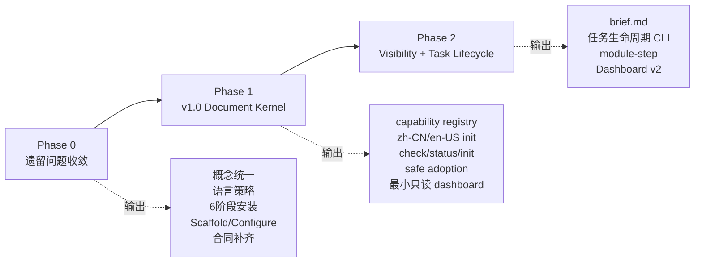
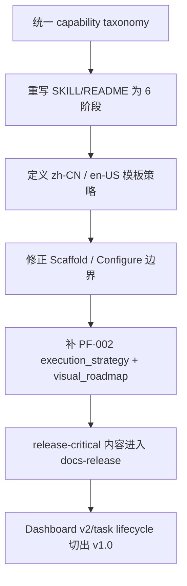
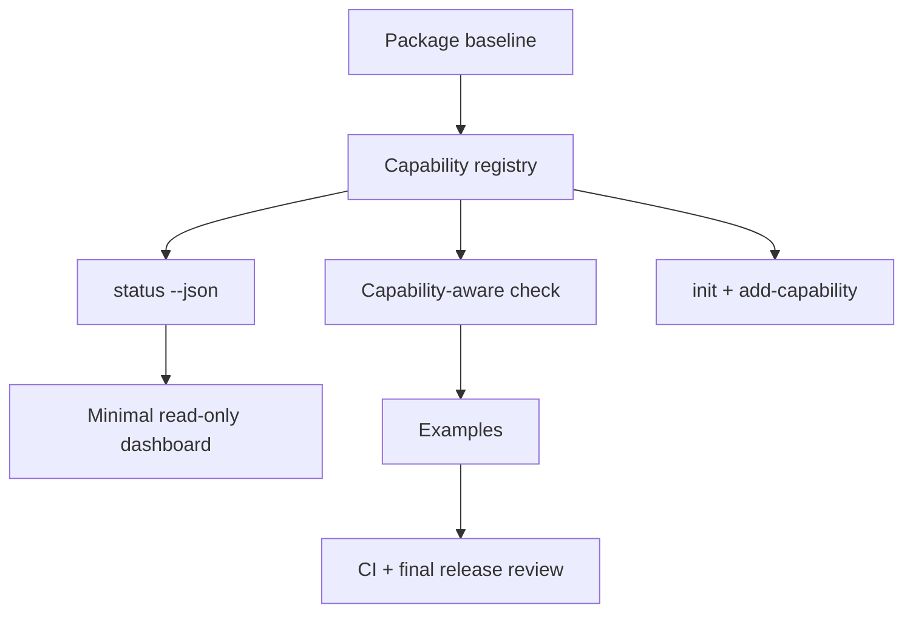
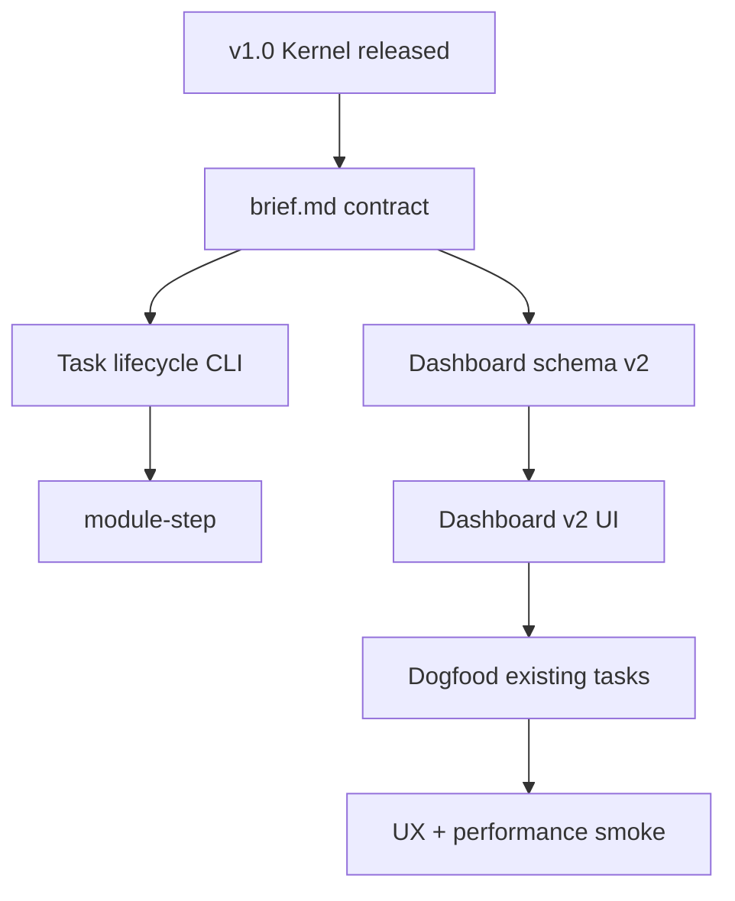

# v1.0 Staged Release Plan

这份计划把当前 v1.0 工作拆成三个阶段：先收敛遗留问题，再发布 v1.0
Document Kernel，最后做 Dashboard v2 和任务生命周期能力。

## 1. 总体判断

当前所有功能都有意义，但不应该共享同一个 v1.0 release gate。



一句话：v1.0 先交付稳定内核；Dashboard v2 和写入型任务生命周期命令作为下一阶段能力。

## 2. Phase 0 - 遗留问题收敛

目标：让计划、公开文档、私有任务合同和代码接口说同一种话。



完成内容：

| 工作 | 完成定义 |
| --- | --- |
| Capability taxonomy | 公开文档、CLI registry、示例、README 使用同一组能力名 |
| Six-phase install | `SKILL.md` 和 README 统一为 Diagnose / Decide / Scaffold / Configure / Verify / Deliver |
| Locale strategy | `init` 询问或接收 `--locale zh-CN\|en-US`，生成对应语言的长期操作文档 |
| Scaffold/Configure | CLI scaffold 不把项目级 reference 假装成已配置标准 |
| PF-002 contract | v1.0 主任务有独立 `execution_strategy.md` 和 `visual_roadmap.md` |
| docs-release | release-critical 策略不依赖未发布的 `docs/plans` |
| Dashboard v2 boundary | Phase 2 能力明确不阻塞 v1.0 kernel release |

Phase 0 完成后才进入 v1.0 实现/收口。

## 3. Phase 1 - v1.0 Document Kernel

目标：交付公开、可安装、可检查、可安全采用的 document kernel。



Phase 1 做：

- `harness check`
- `harness status --json`
- `harness init`
- `harness init --locale zh-CN|en-US`
- `harness add-capability`
- `.harness-capabilities.json`
- 中文/英文两套用户侧模板
- capability 选择规则和 install report
- safe adoption mode
- minimal read-only dashboard
- minimal/full examples
- 两条回归路径：
  - 新项目从空目录初始化 harness。
  - 老项目已有旧版 harness 时平滑迁移，不覆盖历史文档。
- `Markdown-Review` dogfood 安装验收，测试产物默认清理
- CI and final review

Phase 1 不做：

- Dashboard v2
- `brief.md` 强制任务合同
- `new-task / task-phase / module-step`
- control dashboard
- automatic migration
- automatic global table writes

验收命令：

```bash
npm test
npm run smoke:dashboard
node scripts/harness.mjs check --profile source-package .
node scripts/harness.mjs check --profile private-harness .harness-private
node scripts/harness.mjs check --profile target-project examples/minimal-project
node scripts/harness.mjs init --dry-run --locale zh-CN --capabilities core /tmp/harness-zh-fixture
node scripts/harness.mjs init --dry-run --locale en-US --capabilities core /tmp/harness-en-fixture
```

额外验收：

- `init` / `add-capability` 输出包含 install report。
- `core,dashboard` 新装项目不会因为 core 自带 Lessons SSoT 被误判为 `safe-adoption`。
- `add-capability safe-adoption --locale ...` 对旧 harness 项目只补缺失文件，不覆盖
  `AGENTS.md`、`CLAUDE.md`、`Harness-Ledger` 或历史 task。
- 已声明 `safe-adoption` 的旧项目，普通 `status --json` 把历史合同缺口列为
  `adoption-needed` warning；`status --json --strict` 仍失败。
- Agent dogfood 能读 `SKILL.md`、显式传 `--locale`、完成安装 summary，并在测试结束后清理目标仓库。

## 4. Phase 2 - Visibility + Task Lifecycle

目标：把 HTML 从“状态展示”升级为用户真正愿意打开的项目可见性层。



Phase 2 做：

- `brief.md` task/module visibility contract
- `harness new-task`
- `harness task-start`
- `harness task-phase`
- `harness task-complete`
- `harness task-block`
- `harness task-log`
- `harness task-list`
- `harness module-step`
- dashboard schema v2
- Dashboard v2: Overview / Task Index / Task Detail
- search, Mermaid, module topology, lessons, mobile/fallback behavior

验收重点：

- 100+ 任务搜索仍可用。
- 移动端 375px 可读。
- Mermaid/CDN 不可用时有 fallback。
- 生成 HTML 不泄露 `.harness-private` 或本机绝对路径。
- task lifecycle 命令 round-trip 可验证。

## 5. Release Decision Rules

| Rule | Meaning |
| --- | --- |
| Phase 0 P1 blockers close before coding | 防止继续在错误边界上开发 |
| Phase 1 dashboard is minimal/read-only | 不把弱 dashboard 包装成最终 UX |
| Phase 2 starts after v1.0 kernel gate | 防止 scope 再次膨胀 |
| Dashboard UX dissatisfaction routes to Phase 2 | 除非有数据泄露或写入风险，否则不阻塞 kernel |

## 6. Current Recommendation

先执行 Phase 0。Phase 0 关闭后，再启动 v1.0 kernel hardening。Dashboard v2
和 task lifecycle 作为下一阶段能力单独计划、单独验收。
