# v1.0 可视化路线图

这份路线图用于回答一个问题：v1.0 现在到底准备怎么做。

## 1. 最终定位

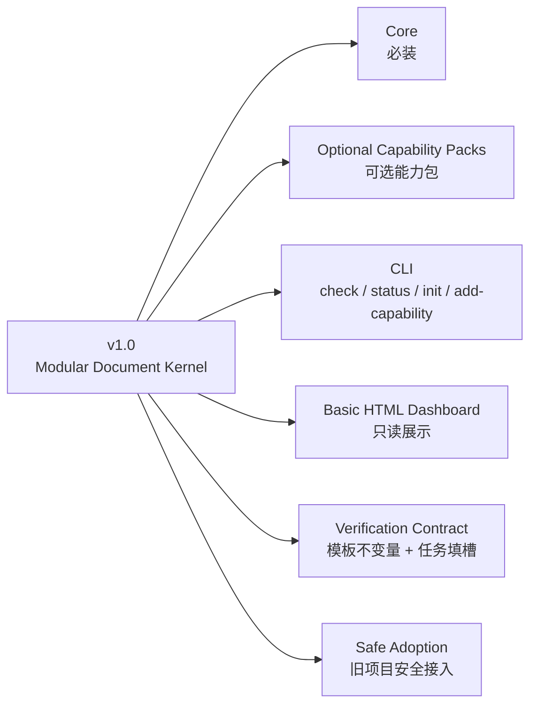

一句话：v1.0 是一个可安装、可检查、可裁剪、可视化查看状态的文档内核。

## 2. 能力包关系

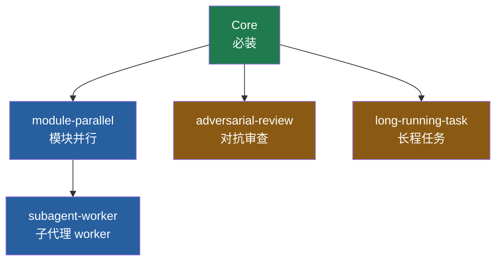

简单项目只装 Core。复杂项目按需装能力包。`subagent-worker` 依赖 `module-parallel`。

## 3. Scaffold / Configure 分层

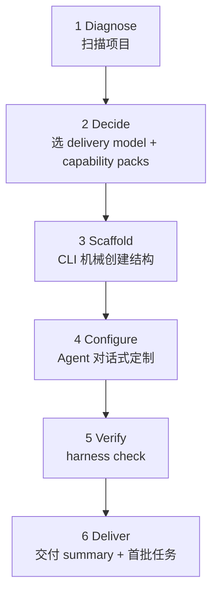

关键原则：

| 层 | 谁做 | 做什么 | 不做什么 |
| --- | --- | --- | --- |
| Scaffold | CLI | 目录、模板、空表、`.harness-capabilities.json` | 不生成假 reference |
| Configure | Agent + 用户 | AGENTS、references、CI、regression surface | 不机械复制源仓标准 |

## 4. 四个实现 Wave

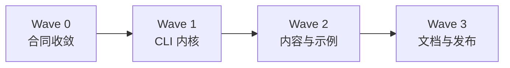

| Wave | 目标 | 包含 |
| --- | --- | --- |
| Wave 0 | 锁定范围 | scope、non-goals、capability packs、P2 关闭 |
| Wave 1 | CLI 内核 | package、capability registry、check、status、init、add-capability |
| Wave 2 | 内容与示例 | SKILL.md 六阶段、minimal/full examples、basic dashboard、safe adoption |
| Wave 3 | 发布收口 | public docs、CI、verification contract、final review |

## 5. 依赖图

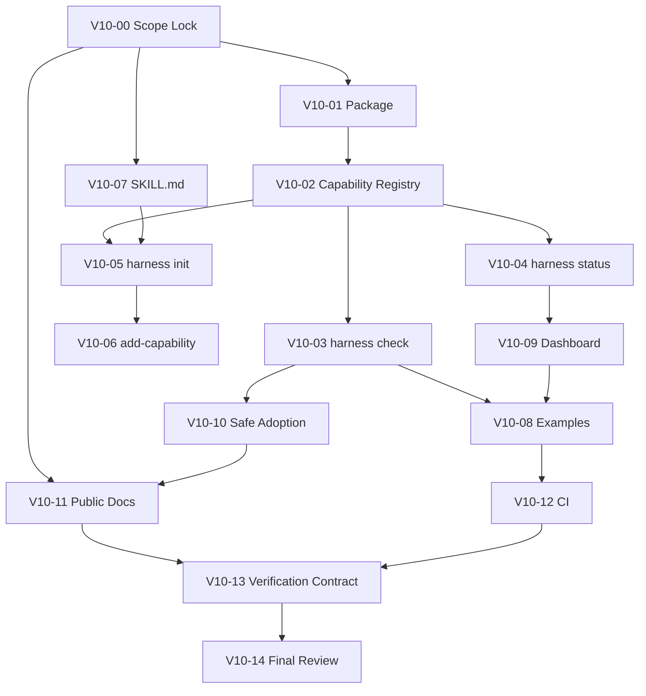

## 6. 只读 Dashboard 表达设计

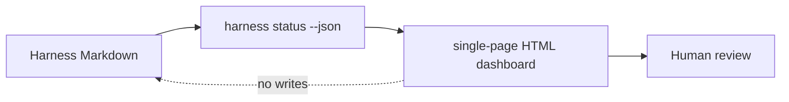

Dashboard 只展示：

- 当前任务进度
- installed capabilities
- pending handoff
- open risk
- recent activity
- task visual roadmap

不做控制，不写文件，不做后端。

### Dashboard 页面结构

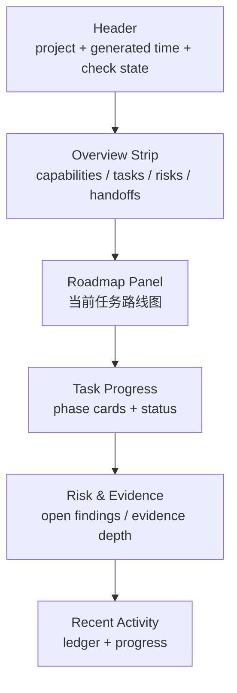

HTML 不只是 Markdown 渲染，它要把数据换成更容易扫读的表达：

| Markdown 数据 | HTML 表达 |
| --- | --- |
| task `visual_roadmap.md` Mermaid | 主路线图面板 |
| phase table | 阶段卡片 / swimlane |
| status 字段 | badge + color |
| pending handoff | warning strip |
| findings severity | risk lane |
| evidence depth | evidence meter |
| capability registry | capability chips |

### Dashboard JSON Contract

v1.0 dashboard 只能消费 `harness status --json`，不能在 HTML 层重新自由解析 Markdown。

```json
{
  "project": {"name": "example", "root": "TARGET:."},
  "generatedAt": "2026-05-18T00:00:00Z",
  "mode": "legacy-compat | declared-capability",
  "checkState": {"status": "pass | warn | fail", "failures": 0, "warnings": 0},
  "capabilities": [
    {"name": "core", "state": "configured", "dependencyStatus": "valid", "warnings": []}
  ],
  "tasks": [
    {
      "id": "TASK-001",
      "title": "Example task",
      "state": "in_progress",
      "completion": 40,
      "dependencies": ["TASK-000"],
      "phases": [
        {
          "id": "PH-01",
          "dependsOn": [],
          "state": "in_progress",
          "completion": 40,
          "output": "Dashboard fixture",
          "requiredEvidence": ["fixture", "screenshot"],
          "evidenceStatus": "partial",
          "blockingRisk": "status schema still changing",
          "owner": "coordinator"
        }
      ],
      "risks": [
        {"id": "R-001", "severity": "P1", "open": true, "blocksRelease": true, "summary": "Nested status schema missing"}
      ],
      "evidence": [
        {"id": "E-001", "type": "fixture", "path": "TARGET:fixtures/status/basic.json", "status": "present", "summary": "status JSON fixture"}
      ]
    }
  ],
  "handoffs": [
    {"id": "H-001", "from": "worker", "to": "coordinator", "state": "pending", "summary": "global sync required"}
  ],
  "recentActivity": [
    {"at": "2026-05-18T00:00:00Z", "type": "review", "summary": "P1 dashboard schema finding mitigated"}
  ]
}
```

Nested fields stay deliberately small in v1.0:

| Field | Required Semantics |
| --- | --- |
| `phases[].state` | `planned`, `in_progress`, `review`, `blocked`, `done`, `skipped` |
| `phases[].completion` | integer `0..100`; `done=100`; `planned=0`; `skipped` excluded from overall average |
| `phases[].evidenceStatus` | `missing`, `partial`, `present`, `waived` |
| `risks[].severity` | `P0`, `P1`, `P2`, `P3`; release blocks P0/P1/material-P2 when `open=true` or `blocksRelease=true` |
| `evidence[].type` | `command`, `diff`, `fixture`, `screenshot`, `review`, `report` |
| `evidence[].path` | `PUBLIC:`, `PRIVATE:`, `TARGET:`, `EXTERNAL:`, or `URL:` prefixed path |
| `handoffs[].state` | `pending`, `accepted`, `synced`, `blocked` |

Capability chip 颜色按状态，不按能力类型：

| State | HTML 表达 |
| --- | --- |
| `scaffolded` | gray / 待配置 |
| `configured` | blue / 待验证 |
| `verified` | green / 已验证 |
| invalid or blocked | red / 阻塞 |

### 任务 Visual Roadmap

每个非平凡任务都应该有独立的 `visual_roadmap.md`。`task_plan.md` 只保留
目标、范围、步骤和验收，不承载可视化路线本体。

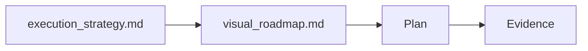

这部分由 agent 在任务设计时维护。HTML dashboard 只读取并渲染，不重新推导路线。

最小格式：

```text
# Visual Roadmap

mermaid diagram

phase table
```

Dashboard parser 支持的 phase table 固定为：

| Phase ID | Depends On | State | Completion | Output | Required Evidence | Evidence Status | Blocking Risk | Owner / Handoff |
| --- | --- | --- | --- | --- | --- | --- | --- | --- |
| V10-09 | V10-04 | planned | 0 | Dashboard output | fixture + screenshot | missing | status contract pending | coordinator |

Allowed `State`: `planned`, `in_progress`, `review`, `blocked`, `done`, `skipped`.
Allowed `Evidence Status`: `missing`, `partial`, `present`, `waived`.
`Completion` is an integer `0..100`; `done` must be `100`, `planned` must be
`0`, and `skipped` phases are excluded from the overall average.

HTML 用这个表计算：

- overall completion
- phase cards
- locked / blocked nodes
- evidence meter
- handoff strip

这样任务的“怎么做”有两份互补表达：

- `execution_strategy.md`：谁来做、是否用 subagent、怎么审。
- `visual_roadmap.md`：分几个阶段、阶段之间怎么依赖、当前走到哪。

## 7. 旧项目 Safe Adoption

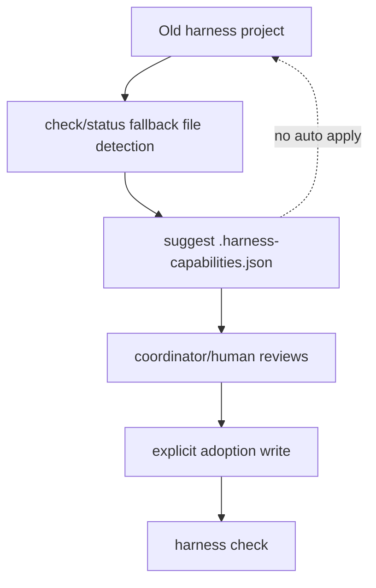

v1.0 支持安全接入，不支持自动迁移：

- 不重装旧项目。
- 不覆盖旧事实。
- 不自动改 AGENTS / registry / ledger。
- 不自动 archive 历史目录。
- 只给 adoption suggestion，由 coordinator/human 确认后写入。

Safe Adoption 有两个模式：

| Mode | 什么时候 | orphan artifact 规则 |
| --- | --- | --- |
| `legacy-compat` | 没有 `.harness-capabilities.json` | 不报 orphan warning，只给 adoption suggestion |
| `declared-capability` | 已存在 `.harness-capabilities.json` | 未声明但存在的能力文件才报 orphan warning |

## 8. 执行策略与路线图记录

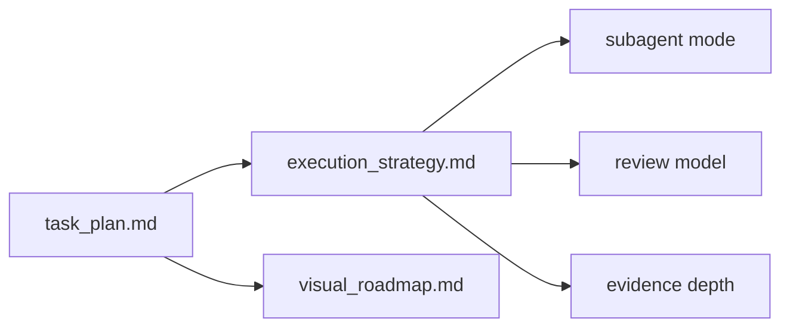

每个任务都要记录：

- 主执行者是谁。
- 是否用 subagent。
- subagent 是 reviewer-only 还是 worker-worktree。
- review 模型是什么。
- 证据深度是多少。
- worktree / handoff 怎么处理。
- 可视化路线图是什么。

复杂任务还需要记录 Task IA Budget：

| Budget | 规则 |
| --- | --- |
| simple | 只用核心五件套 |
| complex | 按触发条件启用 `references/INDEX.md`、`artifacts/INDEX.md`、`slices/<slice-id>/` |

触发条件：

- reviewer/subagent 输入包需要复用：启用 `references/INDEX.md`
- 命令输出、截图、fixture、review transcript：启用 `artifacts/INDEX.md`
- 超过 5 个 slice、多 worker、release gate、L2+ evidence：启用 `slices/`

不要默认创建空目录。公开 scaffold 只能复制核心任务文件；optional stubs 必须放在
单独模板包里，只有触发条件满足时才复制。

## 9. Review / Evidence 可判定状态

Findings 表必须把人类说明和机器 gate 分开：

| Field | Allowed Values |
| --- | --- |
| Severity | `P0`, `P1`, `P2`, `P3` |
| Open | `yes`, `no` |
| Disposition | `open`, `mitigated`, `closed`, `deferred`, `accepted-risk`, `not-reproducible`, `out-of-scope` |
| Blocks Release | `yes`, `no` |

Evidence 使用 `type:path:summary` 或 artifact index：

```text
command:artifacts/INDEX.md#ART-001:checker passed
review:PRIVATE:docs/.../review.md:adversarial review completed
```

## 10. 发布门禁

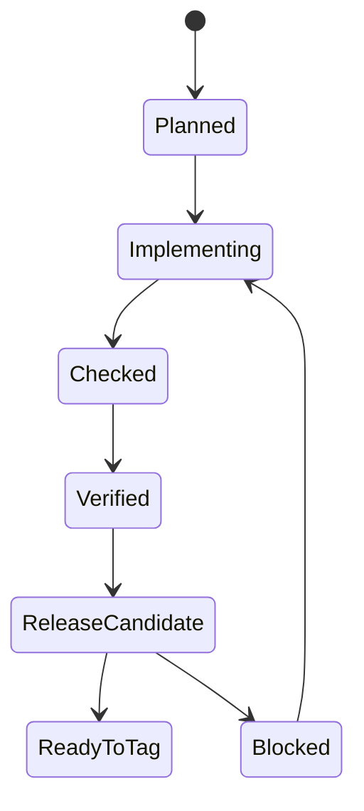

Release candidate 前必须满足：

- 无 release-blocking P0/P1/material-P2 strategy findings。
- `scripts/check-harness.mjs` 旧入口不坏。
- `.harness-capabilities.json` 支持 dependency + state validation。
- checker 使用静态规则组，不动态加载代码。
- checker profiles 明确区分 `source-package`、`private-harness`、`target-project`。
- `harness status` 只读。
- `harness status --json` 符合 dashboard JSON contract。
- review schema、checker profiles、safe-adoption modes、verifier contract 都有真实 fixture 和 fail/pass gate。
- dashboard 只读。
- examples 通过 checker。
- CI 只跑已实现命令。
- verification contract 有结构化输出。
- 每个非平凡任务记录 execution strategy。
- 每个非平凡任务记录 visual roadmap，HTML dashboard 能渲染。
- 旧项目 safe adoption 不自动 apply。

## 11. v1.0 明确不做

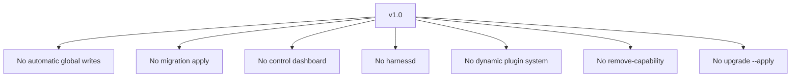

这些都放到 v1.1+ / v1.2 / v2.0。
