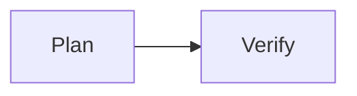

# Visual Roadmap

| Phase ID | Depends On | State | Completion | Output | Required Evidence | Evidence Status | Blocking Risk | Owner / Handoff |
| --- | --- | --- | --- | --- | --- | --- | --- | --- |
| P1 | none | done | 100 | Example plan | review | present | none | coordinator |
| P2 | P1 | planned | 0 | Example verification | command | missing | none | coordinator |
