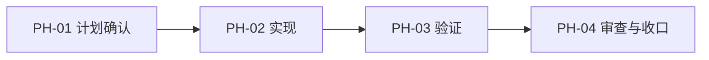

# 可视化路线图

本文件供 HTML dashboard 和人工审查同时使用。Mermaid 图展示阶段关系；阶段表提供可解析的状态、完成度和证据状态。

## 阶段关系图（Phase Graph）

## 阶段表（Phase Table，表头供 checker 解析）

| Phase ID | Depends On | State | Completion | Output | Required Evidence | Evidence Status | Blocking Risk | Owner / Handoff |
| --- | --- | --- | ---: | --- | --- | --- | --- | --- |
| PH-01 | none | planned | 0 | [计划输出] | [必需证据] | missing | none | coordinator |

允许的 `State`：`planned`, `in_progress`, `review`, `blocked`, `done`, `skipped`。

允许的 `Evidence Status`：`missing`, `partial`, `present`, `waived`。

`Completion` 使用 `0..100` 的整数；`done` 应为 `100`，`planned` 应为 `0`，`skipped` 不计入 dashboard 总完成度。dashboard 以阶段表计算进度，不从正文推断。
