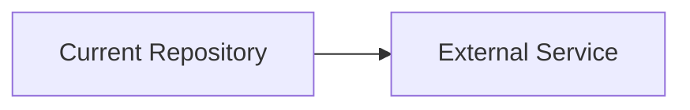

# System Map

Context Doc Type: system-map
Owner: project coordinator
Last Verified: unknown
Confidence: low

## Scope

[Describe the larger system boundary this repository belongs to.]

## Mermaid Map

## Map Evidence

| Node | Meaning | Source Evidence | Last Verified | Confidence |
| --- | --- | --- | --- | --- |
