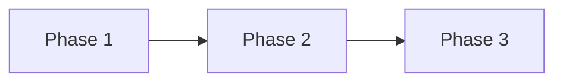

# Visual Roadmap

Use this file to make the task readable in the HTML dashboard. The dashboard
parser expects the phase table schema below.

| Phase ID | Depends On | State | Completion | Output | Required Evidence | Evidence Status | Blocking Risk | Owner / Handoff |
| --- | --- | --- | --- | --- | --- | --- | --- | --- |
| PH-01 | none | planned | 0 | Planned output | Required evidence | missing | none | coordinator |

Allowed `State`: `planned`, `in_progress`, `review`, `blocked`, `done`, `skipped`.
Allowed `Evidence Status`: `missing`, `partial`, `present`, `waived`.
`Completion` is an integer `0..100`; `done=100`, `planned=0`, and `skipped`
is excluded from the overall dashboard average. Dashboard progress is calculated
from this table, not from prose.
